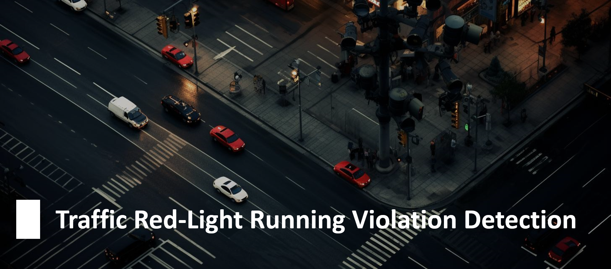

# 🚦 Traffic Red-Light Running Violation Detection

## 🌐 Overview
In urban intersections, there's a critical need for an automatic system that detects red-light running violations through real-time CCTV footage, ensuring violators are identified and fined. While deep learning approaches are often lauded, resource constraints in our scenario necessitated a pivot to classical digital image processing techniques. Despite implementing our solution on an offline video taken under the challenging conditions of nighttime, we still witness the astonishing capabilities of traditional image processing techniques in action.

## 🌟 Key Features 
- 🌃 Non-Deep Learning Real-Time Traffic Light Color Recognition  
- 📐 Adaptive and Stable Digital Image Processing Technique for Night-Time Stop Line Detection and Color-Correlation to Traffic Light Status
- 🚗 Robust License Plate Extraction from Night-Time Traffic Frames using Digital Image Processing Techniques
- 📜 Text Recognition on License Plates with PyTesseract OCR
- 📺 Displaying Penalized License Plates on Video Frames with Dynamic Positioning
- 📊 Database Integration for Recording Fined License Plate Violations using MySQL

## 🎬 Demo

Traffic Red-Light Running Violation Detection in Action:

## 📁 File Descriptions

- 📓 **`Traffic Red-Light Running Violation Detection.ipynb`**: The primary Jupyter notebook containing all code and explanations for this project.
- 🎥 **`traffic_video.mp4`**: Sample video footage used to detect traffic violations.
- 📄 **`haarcascade_russian_plate_number.xml`**: XML file used for license plate detection.
- 📘 **`README.md`**: You're currently reading this file! Provides an overview and useful information about the project.

## 🚀 Instructions for Local Execution

1. **Clone this Repository**: First and foremost, clone this repo to your local machine.
2. **Open the Notebook**: Launch the `Traffic Red-Light Running Violation Detection.ipynb` in Jupyter.
3. **Setup Dependencies**: Make sure you've installed all necessary Python libraries and have a local MySQL database running.
4. **Database Credentials**: Inside the notebook, replace the `your_username` and `your_password` placeholders in the database connection section with your actual database credentials.
5. **Execution**: Execute all cells in the notebook to view the results.

## 🔗 Additional Resources

- 🌐 **Kaggle Notebook**: Interested in a Kaggle environment? Explore the notebook [here](https://www.kaggle.com/code/farzadnekouei/traffic-red-light-running-violation-detection).
- 📹 **Input Video Data**: Access the raw and modified video [here](https://www.kaggle.com/datasets/farzadnekouei/license-plate-recognition-for-red-light-violation).
- 🎥 **Project Demo**: Watch the live demonstration of this project on [YouTube](https://www.youtube.com/watch?v=dzHYjDuRYzs).
- 🤝 **Connect on LinkedIn**: Have questions or looking for collaboration? Let's connect on [LinkedIn](https://linkedin.com/in/farzad-nekouei-7535aa53/).
